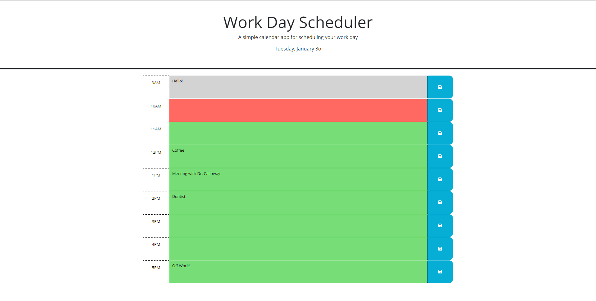

# Work Day Scheduler

## A simple calendar app for scheduling your work day.

- This creates functionality on a pre-existing scheduler.
- This was built to manage time, and better understand JavaScript.
- This scheduler allows the user to schedule meetings and stay on track of thier day.
- I learned how useful jquery and dayjs can be for tracking time.

## Usage

- Website Url: https://lindstdb.github.io/Daily-Planner/

## Screenshot

